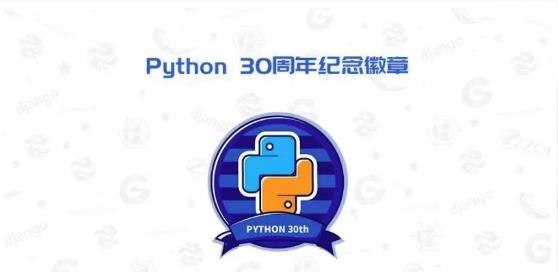

# 中国 Pythonista 现状调研：聊聊你和 Python 的那些事儿？

## 问卷

```console
PyCon 是 Python 语言社群的全球性技术盛会，PyCon China 是由 PyCon 官方授权 CPyUG (华蠎用户组)举办的 Python 年会。

2019 年，是 Python 诞生的三十周年。我们将举行 PyCon China 2019 活动来庆祝这一门伟大语言的生日。
```

在此之前，我们想更多地了解你与 Python 的那些事儿。或许你是一位刚刚入门 Python 的编程新手，或许你常常使用 Python 写些脚本来提升工作效率，或许你已经使用 Python 作为主力语言叱咤计算机界多年。不论 Python 在你的生活、工作中扮演什么样角色，相信你一定与 Python 结下了不解之缘。

**快来和我们说说你和 Python 的情缘**，你们相识了多久？常常在哪座城市相伴？ta 是否是你工作中的灵魂伴侣？和 ta 一起常做哪些事儿？我们有太多的问题想要迫不及待知道答案，恳请你扫描下面二维码或者打开链接来告诉我们：

https://www.wjx.cn/jq/43310160.aspx


扫描二维码，填写问卷。

【心动福利】

填写调查问卷的小伙伴，即有机会在各城市活动现场免费领取设计精美的“ Python 三十周年纪念徽章”一枚！

请在 PyCon China 2019 大会现场凭您参与调研时留下的手机号码，进行确认领取。



## 会议日程

### 上海站：2019 年 09 月 21 日

上海杨浦区宁国路上海兴荣温德姆酒店

早鸟票报名链接：https://www.bagevent.com/event/5293611

（限量早鸟票 200 张！先到先得）

---

### 深圳站：2019 年 10 月 20 日

广东省深圳市南山区软件产业基地

早鸟票报名链接：https://www.bagevent.com/event/5451680

（限量早鸟票 80 张！先到先得）

---

### 北京站：2019 年 10 月 19 日

北京朝阳区酒仙桥路 6 号院 360 大厦

早鸟票报名链接：https://www.bagevent.com/event/5717698

（限量早鸟票 80 张！先到先得）

---

### 杭州站：2019 年 10 月 19 日

---

### 成都站：2019 年 10 月 26 日

---

### 南宁站：2019 年 10 月 26 日
